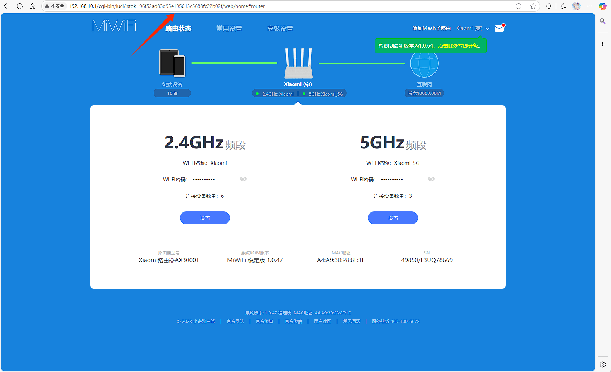

# 开启ax3000t的ssh功能
## 方案一
### 1.开启ssh
:::caution[注意]
系统要不高于系统版本1.0.47 高于需使用官方工具降级 新生产的小米AX3000T似乎换了硬件，降级系统会变砖请看方案二
:::

1. 登录小米路由器后台，复制自己的stok变量 如上图stok值为96f52ad83d95e195613c5688fc22b02f
2. 打开Windows系统 win+r 打开运行 输入cmd打开终端
3. 依次输入以下代码，小米 AX3000T 解锁 SSH 命令：（整体替换为你浏览器地址栏看到的数值）
4. 输入以下代码，确认解锁 SSH：
:::caution[注意]
192.168.10.1是路由器ip地址 小米默认是192.168.31.1 stok的值记得替换
:::
```bash
curl -X POST http://192.168.10.1/cgi-bin/luci/;stok=0a53ad5b8027c954d73b12ba8622668e/api/misystem/arn_switch -d "open=1&model=1&level=%0Anvram%20set%20ssh_en%3D1%0A"
```
```bash
curl -X POST http://192.168.10.1/cgi-bin/luci/;stok=0a53ad5b8027c954d73b12ba8622668e/api/misystem/arn_switch -d "open=1&model=1&level=%0Anvram%20commit%0A"
```
```bash
curl -X POST http://192.168.10.1/cgi-bin/luci/;stok=0a53ad5b8027c954d73b12ba8622668e/api/misystem/arn_switch -d "open=1&model=1&level=%0Ased%20-i%20's%2Fchannel%3D.*%2Fchannel%3D%22debug%22%2Fg'%20%2Fetc%2Finit.d%2Fdropbear%0A"
```
```bash
curl -X POST http://192.168.10.1/cgi-bin/luci/;stok=0a53ad5b8027c954d73b12ba8622668e/api/misystem/arn_switch -d "open=1&model=1&level=%0A%2Fetc%2Finit.d%2Fdropbear%20start%0A"
```
正常情况每条结果都会出现code：0 就是解锁ssh成功了，没有固化ssh，重启系统后可能会丢失ssh连接
### 2.计算ssh密码
登录官方网址： https://miwifi.dev/ssh 输入路由器的SN可以得到SSH密码，路由器后台有显示SN号码。
### 3.固化ssh
:::caution[注意]
固化ssh后，重启系统后不会丢失ssh连接
:::
小米路由器是 Snapshot 系统，重启会重置为最初状态，导致解锁 SSH 失效。提示为connect to host 192.168.10.1 port 22: Connection refused
小米路由器固化ssh挺麻烦的，网上也没有ax3000t的教程，但我们可以设置一个开机启动ssh的脚本来实现重启后开启ssh服务。
```bash
1. 创建目录
mkdir /data/auto_ssh && cd /data/auto_ssh
2. 下载脚本 
# GitHub 地址
curl -kfsSL -O https://raw.githubusercontent.com/lemoeo/AX6S/main/auto_ssh.sh && chmod +x auto_ssh.sh
# jsDelivr CDN 地址
curl -kfsSL -O https://cdn.jsdelivr.net/gh/lemoeo/AX6S@main/auto_ssh.sh && chmod +x auto_ssh.sh
3. 执行命令解锁 SSH 并添加开机自启动
./auto_ssh.sh install
4. 如果不需要自动开启 SSH 服务，使用命令移除开机自启动
./auto_ssh.sh uninstall
```
# 方案二
::github{repo="openwrt-xiaomi/xmir-patcher"}
1. 下载xmir-patcher
2. 将路由器恢复出厂设置，完成初始化配置。解压xmir-patcher，Windows运行run.bat，Linux运行run.sh。
3. 设置路由器IP，选择【1】，输入路由器的IP地址（小米路由器默认192.168.31.1）。
4. 解锁SSH，选择【2】，输入路由器后台管理密码，提交后会输出开启状态。
5. 修改root密码，选择【8】，再选择【2】修改root密码。
6. 固化SSH，选择【8】，再选择【7】固化SSH。
7. 使用SSH工具连接到终端，出现Banner ARE U OK则成功。
